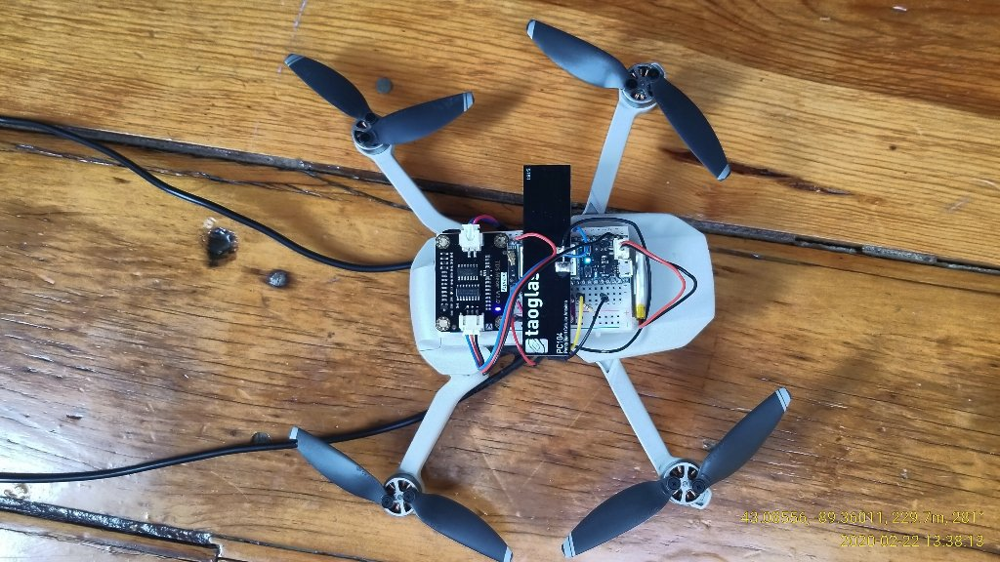
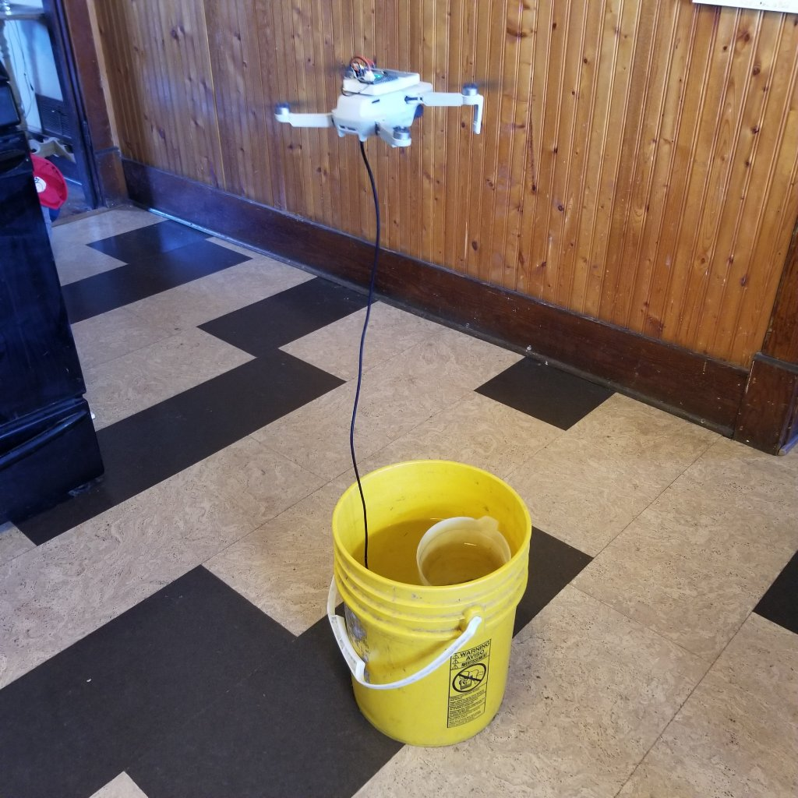

# Ikaros: a Drone based Spudnik -- Monitoring the Planet from Afar

# Description (2020-02-22): 
    Riding on the back of a small drone, Ikaros was sucessfully tested February 22, 2020.
    Based on the popular ;) Spudnik series of water monitoring IOT projects, this Spudnik-Drone takes monitoring to the air and sea. Mounting a reduced size Spudnik on the back of a drone has enabled us to reach across the forests, wetlands and waters to test water quality at a distance.

# Data rendered: 
    A drone mounted IoT project using the Particle Electron to monitor water quality and weather.  
	The unit will monitor:
	Water   Temperature
		Specific conductance
	Air     Temperature
		Humidity
		Pressure
	Battery Percent charge
	Cell	Signal strength
		
# Hardware:
   - Drone: Mavic Mini  https://www.dji.com/mavic-mini
   
   - Particle Electron:  https://store.particle.io/collections/electron  
   
   - Electrical Conductivity / TDS sensor  
     Gravity: Analog TDS Sensor/Meter for Arduino https://www.dfrobot.com/product-1662.html  
     
   - Waterproof temperature sensor  
     from Adafruit:  https://www.adafruit.com/product/381  
     or  
     from Gravity: https://www.dfrobot.com/product-1354.html
     
   - 1 Temperature, humidity, pressure sensor BME280   (1 unit for air)  
     from Adafruit:  https://www.adafruit.com/product/2652  
     or  
     from Amazon.com:   HiLetgo BME280 Atmospheric Pressure Sensor Temperature Humidity Sensor Breakout for Arduino  
       
   - Cellular antenna: GSM/GPRS 5DB patch antenna SMA connector 900mhz-1800mhz . With Pigtail Cable IPX
     Taoglas Cellular Antenna that came with Particle Electron 3G kit
       
   - 4.7 Kohm pull-up/down resistor  
     from adafruit.com:  https://www.adafruit.com/product/2783  
     
   - Lithium Ion Polymer Battery - 3.7v 100mAh
     from adafruit.com: https://www.adafruit.com/product/1570
     
   - Solderless Breadboards  
     from adafruit.com:  https://www.adafruit.com/product/64  
     
# Construction: 

I recommend that you build the device on a solderless breadboard first and make sure everything is running before 
soldering it onto a perma-proto breadboard. 
So far this unit has been constructed only on a solderless breadboard which was then stuck to the top f a drone with double-sided outdoor carpet tape.

# Credits: 
Construction of this unit would not have been possible without the ideas, code and quidance of the following sites/people:

Adafruit.com -- general guidance on construction and coding.  
blog.arduino.cc -- the Arduino community blog for project ideas.
forum.arduino.cc -- the Arduino community forum for coding ideas and guidance.
DFROBOT.com -- code for sampling the Specific Conductance / TDS sensor, including extracting a median of multiple samples.  
Many others that have contributed code and ideas to the Adafruit and Particle forums.  

# Licensed under: 
 GNU GENERAL PUBLIC LICENSE  Version 3, 29 June 2007  
 Copyright (C) 2007 Free Software Foundation, Inc. <https://fsf.org/>    
  GNU GPLv3

Permissions of this license are conditioned on making available complete source code of licensed works and modifications, which include larger works using a licensed work, under the same license. Copyright and license notices must be preserved. 
 
It is the responsibility of the code user to download and read the full the  GNU GENERAL PUBLIC LICENSE  Version 3, 29 June 2007, available at: https://www.gnu.org/licenses/gpl-3.0.en.html



# --Code: A bit of a mess, but it works. Will clean up soon ;)
```C++
/* A project to monitor water quality in remote locations.  Code modified from Spudnik-07
  Uses the Particle Electron powered by a LiPo battery.
  parameters include:
  Water   Temperature                       --ds18b20
          Specific conductance              --Gravity: Analog TDS Sensor/Meter
  Air     Temperature, Humidity, Pressure   --BME280
  Battery Percent charge                    --internal to Electron
  Cell	  Signal strength                   --internal to Electron

  Parameter values are sent to:
    Ubidots for storage and plotting
    Particle for tracking of unit activity

  In general the code is written to, hopefully, not "hang" if a sensor is missing or fails.
    This code has been run on a "bare" electron with only a battery and antenna and "FuelGauge" values
    are reported to the Particle Console and dummy values are reported to Ubidots sucessfully.

  Delays and Particle.process() are implemented after upload of the data so that there is time for
  OTA software updates. In any case OTA updates seem to be sensitive to timing.  The delay for OTA upload
  requires SYSTEM_THREAD(ENABLED) otherwise the code gets stuck while checking for Cellular.connect();

  If cell signal is weak and the Particle can not connect for 2 minutes it flashed blue LED, writes a message
  to serial, tries 1 more minute and then goes back to sleep.

*/
#include "sensitive_definitions.h"  // this file contains ubidots token definition
                               // e.g.  #define your_token ""  // Put here your Ubidots TOKEN
// for the temp. humidity, pressure BME280 sensor
#include <CE_BME280.h>
// Create two BME280 instances
CE_BME280 bme1; // I2C  for air temp. pressure, humidity
//CE_BME280 bme2; // I2C   for WATER temp. & pressure

//BME280_I2C bme1(0x76); // I2C using address 0x76
//BME280_I2C bme2(0x77); // I2C using address 0x77

#include <Adafruit_DHT_Particle.h>  // air and humidity sensor.   includes "isnan()" function

// for the ds18b20 temperature sensor in the water next to the "TDS" sensor
//#include "DS18.h"
#include <DS18B20.h>
/* D4 - 1-wire signal, 2K-10K resistor to 3v3
A pull-up resistor is required on the signal line. The spec calls for a 4.7K.  This can be implemented with the junction board that is included
with the dfRobot temperature sensor  */
//DS18 ds18sensor(D4);  // set on the digital 4 pin
DS18B20  ds18b20(D4, true); // true indicates singleDrop (i.e. only one sensor)

#include <Ubidots.h>   // using here Ubidots=3.1.4

SYSTEM_MODE(AUTOMATIC);   // was set at semi_automatic but I could not flash remotely, tried automatic then set back to semi-automatic
//The only main difference between SEMI_AUTOMATIC mode and AUTOMATIC mode is that for semi-automatic
    // Particle.connect() is not called at the beginning of your code;  With semi-automatic you must call Particle.connect() yourself
//SYSTEM_THREAD(ENABLED);       // seems to make the checking for connection routine work, keep an eye on this ****
//#define your_token "xyz..."  // for privacy, the Ubidots token is defined in the included .h file as "your_token"
#define DATA_SOURCE_NAME "Drone1"
#define unit_name "Drone-01"
#define code_name "particleDrone01"

Ubidots ubidots(your_token, UBI_TCP); // A data source with particle name will be created in your Ubidots account
                            // your_token is defined in sensitive_definitions.h

// initialize variable for water temperature
  double temperature = -99.9;
  const int      MAXRETRY          = 4;
  int      ii          = 0;
//initialize for BME280 bme2 AIR temp, humidity, pressure readings
  float t1 = -99.9;
  float h1 = -99.9;
  float p1 = -99.9;
//initialize for BME280  bme2 WATER temp, pressure readings
  //float t2 = -99.9;
  //float p2 = -99.9;
//initialize variable to hold the ds18 sensor address
///  uint8_t ds18addr[8];
//initialize timing variables
  int sleepInterval = 60;  // This is used below for sleep times and is equal to 60 seconds of time.
  int a_minute = 60000; // define a minute as 60000 milli-seconds
  int minutes = 15;
/*
D0 = SDA for temp/humid/pressure sensor (BME280)
D1 = SCL for temp/humid/pressure sensor (BME280)

C0 = power for digital sensors (BME280 & DS18 water temp)
C4 = high to hold BME280  SD0 high
D4 = water temperature sensor (ds18b20 )
// D5 = power for 1st analog sensor (  )
// D6 = power for 2nd analog sensor (TDS)  not needed, TDS runs off of B1
D7 = ledPin  to flash LED

//A0 = analog pin for depth sensor   //not needed when using the BME in oil depth sensor
A5 = analog pin for rain sensor
A2 = analog pin for TDS/Sp.C sensor

B0 = used as digital power pin to supply 3.3 volts to RAIN analog sensor
B1 = used as digital power pin to supply 3.3 volts to TDS analog sensor
*/
//int DepthPin = A0;  //unused analog depth sensor
//int RainPin = A5;
int SpCSensorPin  = A3;
int ledPin = D7;         // LED connected to D7
  // reset the system after 15 min if the application is stuck.  set as an escape from some hangup.
    // watchDog is petted after cell connection estsblished
  ApplicationWatchdog wDog(900000, System.reset);

// ---------SETUP------------
void setup() {
    Serial.begin(9600);
    Particle.variable("temp", temperature);

//  Do I need to set up D0 and D1 in some way for the BME280s   ????????????
  pinMode(ledPin, OUTPUT);          // Sets pin as output
// create power on digital pins for stable power supply AND so that sensors are shut down
  // when processor is shut down
	pinMode(C0, OUTPUT);     // power for the all digital sensors
	digitalWrite(C0, HIGH);
  pinMode(D3, OUTPUT);     // power for BME280
  digitalWrite(D3, HIGH);
  pinMode(D2, OUTPUT);     // ground for BME280
  digitalWrite(D2, LOW);   //
  pinMode(C4, OUTPUT);     // to hold BME280  SD0 high by 3.3 V. at C4 see HiLetGo_BME280.txt,  sets bme1 address to 0x77
  digitalWrite(C4, HIGH);
//  pinMode(D0, OUTPUT);     // ground for BME280
//	digitalWrite(D0, LOW);

  pinMode(D4, INPUT_PULLUP);  // water temp sensor DS18.
                              //activate the Electron internal pullup resistor but also have a 4.7Kohm pullup on the board
//	pinMode(D6, OUTPUT);     // power for 2nd analog sensor nt needed because TDS powered off B1
//	digitalWrite(D6, HIGH);

	//pinMode(B0, OUTPUT);     // power for analog rain sensor
	//digitalWrite(B0, HIGH);	//
  pinMode(B0, OUTPUT);     // power for analog TDS sensor
  digitalWrite(B0, HIGH);	//
	delay(100);   // delay to give time for power to turn on, don't know if this is needed

 // setup BME280
    if (!bme1.begin(0x77)) // the air sensor BME280 for temp, humidity, pressure
                  //  with SD0 held high by wire to 3.3 V. see HiLetGo_BME280.txt
    {
      Serial.println("Could not find 1st valid BME280 sensor, check wiring!");
      Particle.publish("ObiDots", "could not find bme1",60,PRIVATE);
        //  while (1);  // original code had this but seems like an endless loop if the BME is not detected.
      }
 Serial.println("ending setup");
} // end setup()

//-----------LOOP
void loop() {
  char publishStr[30];
  char event_name[30];
  //Serial.println("in loop");
  FuelGauge fuel; // Initalize the Fuel Gauge so we can call the fuel gauge functions below.
  //  set the deep sleep timer based on the battery charge
  float SoC = fuel.getSoC();
    if (SoC <10)   //  testing seems to indicate unit stops connecting to internet when too low
            { // if battery below 25%, don't even try to connect but go to sleep for 9 hours
              minutes = 432000;   // sleep 5 days if battery very low
              sprintf(publishStr, "not connecting, sleeping for %2i minutes to charge battery ", minutes);
              Serial.println(publishStr);
              LowBattBlink();
              // could add code to collect data and write to SD card, or set flag to use later to skip connecting
              //System.sleep(SLEEP_MODE_SOFTPOWEROFF, sleepInterval * minutes);
             System.sleep(SLEEP_MODE_DEEP, sleepInterval * minutes);
            }

    //---------- populate the variables to send to ubidots ----------
    //--- get battery info
//    float volts = fuel.getVCell();

// ---- get Water temperature from the ds18b20
/*
    int ii = 0;
    while ( (temperature < -99.0) && (ii<5) ) // -99.9 is default temperature value & flag for ds18 read error, try 5 times
      { if (ds18sensor.read(ds18addr))
           {
                delay(100*ii);
                temperature = ds18sensor.celsius();
           }
           delay(500*ii);
           ii++;
       }
*/
//  float rain = analogRead(RainPin);
//  digitalWrite(B0, LOW);     //turn off power to the rain sensor, otherwise it interfears
                             // with the next analog sensor (i.e. TDS/Sp.C)
//  delay(200);
  temperature = getDS18Temp()+0.5;  // ???????????????????????????????????+0.5
  // ---- get AIR temperature and humidity and pressure
            // from BME280 using I2C connection
        int i = 0;
        while(i<2)  // read 2 times to be sure of a good read
             {
               t1 = bme1.readTemperature()-0.7;
               h1 = bme1.readHumidity();
               p1 = bme1.readPressure()/100.0;
               delay(200);
               i++;
             }
          if (isnan(h1) || isnan(t1) || isnan(p1) )
            { h1 = -99.1; t1 = -99.1; p1 = -99.1;  }   // -99.1 is flag for bme read error
    // ---- get WATER temperature and pressure
            // from the BME280 using I2C connection. being used underwater (enclosed in mineral oil) for depth sensor
//         i = 0;
//         while(i<2)  // read 2 times to be sure of a good read
//              {
//               t2 = bme2.readTemperature()-0.4;
//               p2 = bme2.readPressure()/100.0;
//               delay(200);
//               i++;
//             }
//           // Check if any reads failed but don't hold things up
//        	    if (isnan(t2) || isnan(p2) )
//               {  t2 = -99.1; p2 = -99.1;  }    // -99.1 is flag for bme read error
//
// // ---- get WATER Specific Conductance and median voltage on sensor
    float Sp_C = getSpC();
//    float Avolts = getAvolts();

 //  float depth = getDepth();  // read second depth sensor using function getDepth(). this is analog
        //don't need this without the vented analog depth sensor
// turn off sensor POWER pins after sensors are read
//        digitalWrite(D3, LOW);	 // for the digital sensors, BME280s  & DS18
                //  digitalWrite(D6, LOW);	// not needed because all digital sensors run off D3
                  ///digitalWrite(B0, LOW);	// for the rain sensor
//        digitalWrite(B1, LOW);     //for the TDS-Sp.C sensor
char context[90];
//sprintf(context, "tries=%02i", ii);
// add values to que of data to be uploaded to Ubidots
///	ubidots.add("time(UTC)",Time.now()/60);
  ubidots.add("Temp_C", temperature, context);
//  ubidots.add("Rain", rain);
	ubidots.add("Humidity_%", h1);
	ubidots.add("Air-Temp_C", t1);
  ubidots.add("Pressure_hPA", p1);
// ubidots.add("Depth", depth);     // don't need this without the vented analog depth sensor
//  ubidots.add("H2O-Temp_C", t2);
//  ubidots.add("H2O_hPA", p2);
//  float depth = (p2-p1)*0.40147;  // Hectopascals (hPa) to	Inches Of Water (inH2O)*
//  ubidots.add("Depth_in", depth);
/*
      //  could put some code here to write the data to a SD card before trying to connect
      //
      //
*/
// This command turns on the Cellular Modem and tells it to connect to the cellular network. requires SYSTEM_THREAD(ENABLED)
   //Serial.println("just prior to the Cellular.connect() command");
   //delay(100);
  // Cellular.connect();   // this blocks further code execution (see reference) until connection
                          // when in SYSTEM_MODE(semi_automatic),
                          // unless SYSTEM_THREAD(ENABLED). I have SYSTEM_THREAD(ENABLED);
                          //  in any case, after 5 mins of not successfuly connecting the modem
                          // will give up and stop blocking code execution
   //delay(500);
   //Serial.println("done the Cellular.connect() command, Waiting for Cellular.ready");
      // If the cellular modem does not successfuly connect to the cellular network in
      // 2 mins then blink blue LED and write message to serial below.
      // Regardless of code, after 5 mins of not successfuly connecting the modem will give up.
    /*
      if (!waitFor(Cellular.ready, a_minute * 2))
         {
            WeakSignalBlink();
            delay(500);
            WeakSignalBlink();
            Serial.println("Difficulty connecting. Will try for 1 more min");
            delay(500);
         }
      // check a second time to make sure it is connected, if not, try for 1 more minute
      if (!waitFor(Cellular.ready, a_minute * 1))
         {
            WeakSignalBlink();
            delay(500);
            WeakSignalBlink();
            sprintf(publishStr, " sleeping for %2i minutes to wait for better time ", minutes);
            Serial.print("Difficulty connecting");   Serial.println(publishStr);
            delay(500);
            //System.sleep(SLEEP_MODE_SOFTPOWEROFF, sleepInterval*minutes);
            System.sleep(SLEEP_MODE_DEEP, sleepInterval * minutes);
            // if can't connect for a second time, go to deep sleep for
            // for "minutes" minutes and on wake the program starts from the beginning
          }
   Serial.println("passed the Cellular.ready test");
   Particle.connect();
     delay(500);
     */
  //   Particle.publish("particle", "connected",60,PRIVATE);
  //   delay(1000);
  //   readyForOTA(5000);  // 5 second delay with call to Particle.process() to allow time for OTA flashing
     //delay(1000);
     if(Particle.connected()) { wDog.checkin();  } // resets the ApplicationWatchdog count if connected
                                                     // to cell and connected to Particle cloud.

///  ubidots.send(DATA_SOURCE_NAME,DATA_SOURCE_NAME); // Send data aready added to your Ubidots account.
// if you want to set a position for mapping in Ubidots
//char context[25];
  //sprintf(context, "lat= 47.6162$lng=-91.595190"); //Sends latitude and longitude for watching position in a map
//  sprintf(context, "AirTemp=%05.2f$H2OTemp=%05.2f$A.volts=%05.3f$Depth=%05.2f$tries=%01.1i", t1,t2,Avolts,depth,ii);
//  ubidots.add("Position", 47.6162, context); // need variable named "Position" to set device location
// send data that is already in ubidots list
// add data to list of items to be sent to Ubidots. Max of 10 items in que. Limit set in include file ubidots.h
//      ubidots.add("Volts", volts);
      ubidots.add("Sp_Cond", Sp_C, context);
      ubidots.add("SOC", SoC);
      //if (temperature > -99.0)   // if reading water temperature was successful, send temp and Sp_Cond to Ubidots

  //    ubidots.add("A.volts", Avolts);

// ---- get cell signal strength & quality
      CellularSignal sig = Cellular.RSSI();  //this may hang up the system if no connection.
                                              //So this line has been moved to after the if Cellular.ready statement
//      ubidots.add("CellQual", sig.qual); //value location will show up as Ubidots "context"
//      ubidots.add("CellStren", sig.rssi);
//
//  send the rest of the data to Ubidots
      ubidots.send(DATA_SOURCE_NAME,DATA_SOURCE_NAME); // Send rest of the data to your Ubidots account.
                //2020-01-12 modified UbiConstants.h to allow for sending up to 15 variables
      UploadBlink();
// send some data to the Particle console so that it can be read from there using Curl in a terminal window
      //sprintf(publishStr, "Spudnik-08, Temp.C, Sp.C, A.volts, Rain, %03.2f, %03.2f, %03.2f, %04.0f", value3, value4, value5, rain);
    //  sprintf(publishStr, "%s, %03.2f, %03.2f, %03.2f, %04.0f", unit_name, temperature, Sp_C, Avolts, rain);
    sprintf(publishStr, "%s, Temp.C, Sp.C, A.volts, %05.2f, %06.1f, %05.3f", unit_name, temperature, Sp_C);
      Particle.publish("Temp.C, Sp_C", publishStr, 60, PRIVATE);
//         sprintf(publishStr, "%04.2f  %05.2f  %03.2f (%02.1i)", fuel.getVCell(), SoC, temperature, ii);
//      Particle.publish("battV, SOC, Temp_C ", publishStr, 60, PRIVATE);
         //Particle.publish("", publishStr, 60, PRIVATE);
      Serial.println("finished uploading");
// send warning message to particle console
//      Particle.publish("ObiDots", "uploaded, will sleep in 20 seconds",60,PRIVATE);
//      delay(40000); // 35 second delay to allow time for OTA flashing
    //  or
//      readyForOTA(20000);  // 20 second delay with call to Particle.process() to allow time for OTA flashing

 /*if(System.updatesPending())
       {
         readyForOTA(30000);  // if OTA flash pending wait 30 seconds more to complete.  Not sure if this works.
         sprintf(publishStr, "sleeping %2i minutes", minutes+1);
       }
  else {
    */
  // send message to particle console
//       sprintf(publishStr, "sleeping %2i minutes", minutes);
       sprintf(event_name, " %s_on_%s", unit_name, code_name);
    Particle.publish(event_name, publishStr,60,PRIVATE);
//      readyForOTA(5000); //wait 5 more seconds
// Go to sleep for the amount of time determined by the battery charge
  // for sleep modes see:https://community.particle.io/t/choosing-an-electron-sleep-mode/41822?u=colemanjj
//     System.sleep(SLEEP_MODE_DEEP, sleepInterval * minutes);   //keeps SOC meter running
    // System.sleep(SLEEP_MODE_SOFTPOWEROFF, sleepInterval * minutes);  // shuts down SOC meter
    // SLEEP_MODE_DEEP = 161 μA
    // SLEEP_MODE_SOFTPOWEROFF = 110 μA

delay(5000);
} // end loop()

//*******************************************************************************************
//------------------------------ Functions --------------------------------------------------
//
void LowBattBlink()
     {
          for (size_t i = 0; i < 2; i++)
          {
            digitalWrite(ledPin, HIGH);   // Sets the LED on
            delay(2000);                   // Waits for a sec
            digitalWrite(ledPin, LOW);   // Sets the LED on
            delay(2000);
          }
     }

void WeakSignalBlink()
     {
          for (size_t i = 0; i < 10; i++)
          {
            digitalWrite(ledPin, HIGH);   // Sets the LED on
            delay(150);                   // Waits for a sec
            digitalWrite(ledPin, LOW);    // Sets the LED off
            delay(150);
          }
            digitalWrite(ledPin, HIGH);   // Sets the LED on
            delay(550);                   // Waits for a sec
            digitalWrite(ledPin, LOW);    // Sets the LED off
     }

void UploadBlink()
     {
          for (size_t i = 0; i < 1; i++)
          {
            digitalWrite(ledPin, HIGH);   // Sets the LED on
            delay(500);                   // Waits for a sec
            digitalWrite(ledPin, LOW);   // Sets the LED on
            delay(1000);
          }
          for (size_t i = 0; i < 4; i++)
          {
            digitalWrite(ledPin, HIGH);   // Sets the LED on
            delay(50);                   // Waits for a sec
            digitalWrite(ledPin, LOW);   // Sets the LED on
            delay(50);
          }
     }
/*
// get depth value from analog sensor (not used)
  float getDepth ()
        {
          // #define VREF 3.3      // analog reference voltage(Volt) of the ADC
           #define SCOUNT  30           // number of sample points to collect for averaging
           int analogBuffer[SCOUNT];    // store the analog value in the array, read from ADC
           int analogBufferTemp[SCOUNT];
           int analogBufferIndex = 0,  copyIndex = 0;
          // float averageVoltage = 0;
           float depth = -1.1;

           while (analogBufferIndex < SCOUNT)   // read the sensor every 50 milliseconds, SCOUNT times and store in array
             {
                analogBuffer[analogBufferIndex] = analogRead(DepthPin);    //read the analog value and store into the buffer
                analogBufferIndex++;
                 delay(200u);  //delay 200 milliseconds between taking sample
             }
                analogBufferIndex = 0;

           for(copyIndex=0;copyIndex<SCOUNT;copyIndex++)  // for coppyIndex = 0 to SCOUNT-1
                      analogBufferTemp[copyIndex]= analogBuffer[copyIndex]; // copy analogBuffer to analogBufferTemp
                                                 // remember particle board has analog resolution of 4095
           depth = getMedianNum(analogBufferTemp,SCOUNT);
           return depth;
        }  // end of getDepth
*/
// get SpC value from sensor
  float getSpC()
   {
      #define VREF 3.3      // analog reference voltage(Volt) of the ADC
      #define SCOUNT  40           // number of sample points to collect for averaging
      #define resolution 4095.0  // analog resolution of 4095 with Particle electron
      int analogBuffer[SCOUNT];    // store the analog value in the array, read from ADC
      int analogBufferTemp[SCOUNT];
      int analogBufferIndex = 0,  copyIndex = 0;
      float averageVoltage = 0,  K = 1.098;  // ******************** K is a crude calibration factor that can be used to tune the readings
      float SpC = -1.1;

      while (analogBufferIndex < SCOUNT)   // read the sensor every 50 milliseconds, SCOUNT times and store in array
        {
           analogBuffer[analogBufferIndex] = analogRead(SpCSensorPin);    //read the analog value and store into the buffer
           analogBufferIndex++;
  //         if(analogBufferIndex == SCOUNT)
            delay(50u);  //delay 50 milliseconds between taking sample
        }
      analogBufferIndex = 0;

      for(copyIndex=0;copyIndex<SCOUNT;copyIndex++)  // for coppyIndex = 0 to SCOUNT-1
                 analogBufferTemp[copyIndex]= analogBuffer[copyIndex]; // copy analogBuffer to analogBufferTemp
      averageVoltage = getMedianNum(analogBufferTemp,SCOUNT) * (float)VREF / resolution; // read the analog value,
                                            // remember particle board has analog resolution of 4095
                                            //made more stable by the median filtering algorithm, and convert to voltage value
      Serial.print(temperature);   // temperature comes from a different sensor, outside this function.
      Serial.println(" deg.C at start");
      Serial.print("median analog reading= "); Serial.println(getMedianNum(analogBufferTemp,SCOUNT));
      Serial.print("averageVoltage= "); Serial.println(averageVoltage);
      float compensationCoefficient=1.0+0.019*(temperature-25.0);    //temperature compensation formula: 0.019 used by YSI
                //fFinalResult(25^C) = fFinalResult(current)/(1.0+0.02*(fTP-25.0));
// coefficients given by DFROBOT on their webpage.  Error in that the temp. compensation should be after using the equation
/* TDS=(133.42*compensationVolatge*compensationVolatge*compensationVolatge
            - 255.86*compensationVolatge*compensationVolatge
            + 857.39*compensationVolatge)*0.5*K; //convert voltage value to tds value and multiply by calibration K.
*/
// coefficients for the following equation derived from calibration to
 // hundreds of specific conductance readings taken at SandL04 by an Onset logger running in parallel with the Spudnik
       SpC= ( 18.835*averageVoltage*averageVoltage*averageVoltage
            + 24.823*averageVoltage*averageVoltage
            + 624.194*averageVoltage) /compensationCoefficient * K; //convert voltage value to SpC value, then correct for temp

      Serial.print("SpC Value: ");
      Serial.println(SpC,2);
      return SpC;
   }  // end of getSpC

// get averageVolts value from sensor.  This can be sent to Ubidots for use later to calculate Specific Conductance
float getAvolts()
  {
     #define VREF 3.3      // analog reference voltage(Volt) of the ADC
     #define SCOUNT  40           // number of sample points to collect for averaging
     #define resolution 4095.0  // analog resolution of 4095 with Particle electron
     int analogBuffer[SCOUNT];    // store the analog value in the array, read from ADC
     int analogBufferTemp[SCOUNT];
     int analogBufferIndex = 0, copyIndex = 0;
     float averageVoltage = 0;

     while (analogBufferIndex < SCOUNT)   // read the sensor every 50 milliseconds, SCOUNT times and store in array
       {
          analogBuffer[analogBufferIndex] = analogRead(SpCSensorPin);    //read the analog value and store into the buffer
          analogBufferIndex++;
 //         if(analogBufferIndex == SCOUNT)
           delay(50u);  //delay 50 milliseconds between taking sample
       }
       // copy one array to another
     for(copyIndex=0;copyIndex<SCOUNT;copyIndex++)  // for coppyIndex = 0 to SCOUNT-1  // old way of copying an array
        {
            analogBufferTemp[copyIndex]= analogBuffer[copyIndex];   // copy analogBuffer to analogBufferTemp
        }

     averageVoltage = getMedianNum(analogBufferTemp,SCOUNT) * (float)VREF / resolution; // read the analog value,
             // remember particle board has analog resolution of 4095
             //made more stable by the median filtering algorithm, and convert to voltage value
   return averageVoltage;
  }  // end of getAvolts

// calculate a median for set of values in buffer
int getMedianNum(int bArray[], int iFilterLen)
{     int bTab[iFilterLen];
    for (byte i = 0; i<iFilterLen; i++)
            bTab[i] = bArray[i];                  // copy input array into BTab[] array
    int i, j, bTemp;
    for (j = 0; j < iFilterLen - 1; j++)        // put array in ascending order
         {  for (i = 0; i < iFilterLen - j - 1; i++)
           {  if (bTab[i] > bTab[i + 1])
              {  bTemp = bTab[i];
                 bTab[i] = bTab[i + 1];
                 bTab[i + 1] = bTemp;
               }
            }
          }
   if ((iFilterLen & 1) > 0)  // check to see if iFilterlen is odd or even using & (bitwise AND) i.e if length &AND 1 is TRUE (>0)
        bTemp = bTab[(iFilterLen - 1) / 2];     // then then it is odd, and should take the central value
    else
       bTemp = (bTab[iFilterLen / 2] + bTab[iFilterLen / 2 - 1]) / 2;  // if even then take aveage of two central values
  return bTemp;
} //end getmedianNum

void readyForOTA(uint32_t timeout)   // function to delay the system thread for the timeout period
{ // timeout == 0 waits forever
  uint32_t ms = millis();
  while (timeout == 0 || millis() - ms < timeout)
    Particle.process();
}

float getDS18Temp(){
  float _temp;
  //int   i = 0;

  do {
    _temp = ds18b20.getTemperature();
  } while (!ds18b20.crcCheck() && MAXRETRY > ii++);
  return _temp;
}
 
```
