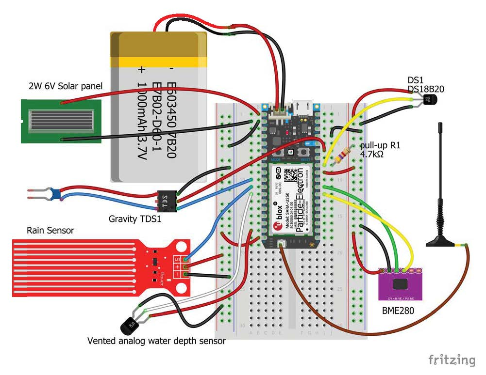

# Spudnik --Monitoring the Liquid-Gas Interface of Planet Akii

# Description (2018-12-03): 
    Powered by the nearest star, Spudnik-06 was launched in early 2018 to monitor water quality and weather in 
    extreme environments ranging from 40C to -48C, some of the colder regions of planet Akii. Soon after arrival 
    at the gas-liquid inerface of the planet, Spudnik-06 was attacked by non-humans and was rendered inoperable. 
    A re-launch in mid-2018 of an armored Spudnik-07 enables the unit to now withstand non-human attack. 
    
    Spudnik7 began reporting to mission central shortly after launch and has been online at 15-minute intervals 
    to report air and water temperature, humidity, and water conductivity at the gas-liquid interface of planet 
    Akii. Spudnik7 will be operating near the surface of one of the planet's hydrologic features known as the 
    Sand River to better understand the interaction between the river and discharges that appear to be linked
    to iron rich geologic formations below the planet's surface.

# Data rendered: 
    A solar powered IoT project using the Particle Electron to monitor water quality and weather.  
	The unit will monitor:
	Water   Temperature
		Specific conductance
	Air     Temperature
		Humidity
		Pressure
	Rain	Index of intensity
	Battery Percent charge
	        Charge voltage
	Cell	Signal strength
		
# Hardware:
   - Particle Electron:  https://store.particle.io/collections/electron  
   
   - 6 Volt 2-4 Watt solar panel:  
     from volyaics systems: https://www.voltaicsystems.com/3-5-watt-panel  
     or  
     from Adafruit:  https://www.adafruit.com/product/200  
     
   - Electrical Conductivity / TDS sensor  
     Gravity: Analog TDS Sensor/Meter for Arduino https://www.dfrobot.com/product-1662.html  
     
   - Waterproof temperature sensor  
     from Adafruit:  https://www.adafruit.com/product/381  
     or  
     from Gravity: https://www.dfrobot.com/product-1354.html
     
   - 2 Temperature, humidity, pressure sensor BME280   (1 unit for air, 1 unit for water pressure)  
     from Adafruit:  https://www.adafruit.com/product/2652  
     or  
     from Amazon.com:   HiLetgo BME280 Atmospheric Pressure Sensor Temperature Humidity Sensor Breakout for Arduino  
     
   - Rain / Water Level Sensor
     from Amazon:  https://www.amazon.com/gp/product/B01N058HS6/  
     or  
     from Newegg:  https://www.newegg.com/Product/Product.aspx?Item=9SIA86V2Z30488   
     
   - Cellular antenna: GSM/GPRS 5DB patch antenna SMA connector 900mhz-1800mhz  
     from Newegg: https://www.newegg.com/Product/Product.aspx?Item=9SIADG45V29158  
     or  
     from ebay: https://www.ebay.com/itm/GSM-GPRS-5DB-patch-antenna-SMA-connector-900mhz-1800mhz-3-m/232927230371  
     
   - Mini PCI UFL to SMA Female Connector Antenna WiFi Pigtail Cable IPX to SMA Extension Connector  
     from Amazon: https://www.amazon.com/gp/product/B07GWHHRFL  
     or  
     from Newegg: https://www.newegg.com/Product/Product.aspx?Item=9SIAAZM4K92552  
     
   - 4.7 Kohm pull-up/down resistor  
     from adafruit.com:  https://www.adafruit.com/product/2783  
     
   - Breadboards  
     from adafruit.com:  https://www.adafruit.com/product/64  
     and  https://www.adafruit.com/product/1609  
     
   - Small Watertight box  
     from amazon: https://www.amazon.com/gp/product/B007JQJE5U   size=small  
     or  
     from wallmart: https://www.walmart.com/ip/Outdoor-Products-Small-Watertight-Dry-Box-Blue/26674162  
     
   - Cable Ports / Cable Glands XJS PG7 PG9  
     from adafruit: https://www.adafruit.com/product/762  
     or  
     from amazon: https://www.amazon.com/gp/product/B07BPH1QY7/  
     
# Construction: 
This is a complex project (it was for me anywhay). So if you are new to this stuff, try something with fewer parts.  
If you are new to building electronic devices visit some of the on-line tutorials for soldering and IoT construction, 
such as Adafruit's video on breadboards (https://youtu.be/w0c3t0fJhXU), soldering techniques (https://youtu.be/QKbJxytERvg), 
and tools (https://youtu.be/J-1phA_vKDg), 

I recommend that you build the device on a solderless breadboard first and make sure everything is running before 
soldering it onto a perma-proto breadboard. Don't get ahead of yourself and solder things up before you have all the bugs 
out and the sensors calibrated.

Depth sensor:  
The Fitzing diagram shows an analog vented depth sensor. In software that is implemented on analog pin A0 and function getDepth(). However, there is no hardware suggested because I am using a surplus part that is no longer available.  
An alternative depth sensor is implemented in code but is experimental and involves placing a 2nd BME280 in mineral oil underwater to detect water pressure.  The air pressure is subtracted from the water pressure and the result converted to inches of water.  Construction of the BME280 based Depth sensor will require a seperate post; to be completed in the near future.  
The monitoring unit will run without any depth sensor.

Install the components and wire them up using 22 gage jumper wires as shown in the Fitzing diagram below:  
  

Wiring can initially be done on a solderless breadboard without the waterproof enclosure for ease of access.  When 
doing the final soldering, route the sensors, solar panel, and antenna wires through cable ports installed in 
your waterproof enclosure. Technique for cutting holes and installing cable glands in the waterproof box can be found
here: https://youtu.be/BR-cIOuWHf0
	
Components can be attached to the inside of the waterproof box with glued-on velcro, glue or very strong double-sided tape.
	
# Credits: 
Construction of this unit would not have been possible without the ideas, code and quidance of the following sites/people:

Adafruit.com -- general guidance on construction and coding.  
blog.arduino.cc -- the Arduino community blog for project ideas.
forum.arduino.cc -- the Arduino community forum for coding ideas and guidance.
DFROBOT.com -- code for sampling the Specific Conductance / TDS sensor, including extracting a median of multiple samples.  
RyanB in the https://community.particle.io forum for code snippets and code ideas on running the Particle Electron on solar power.  
Many others that have contributed code and ideas to the Adafruit and Particle forums.  

# Licensed under: 
 GNU GENERAL PUBLIC LICENSE  Version 3, 29 June 2007  
 Copyright (C) 2007 Free Software Foundation, Inc. <https://fsf.org/>    
  GNU GPLv3

Permissions of this license are conditioned on making available complete source code of licensed works and modifications, which include larger works using a licensed work, under the same license. Copyright and license notices must be preserved. 
 
It is the responsibility of the code user to download and read the full the  GNU GENERAL PUBLIC LICENSE  Version 3, 29 June 2007, available at: https://www.gnu.org/licenses/gpl-3.0.en.html


# --Code:
```C++
/* A project to monitor water quality in remote locations
  Uses the Particle Electron powered by a solar panel and the LiPo battery that comes with the Electron.
  parameters include:
  Water   Temperature                       --ds18b20
          Specific conductance              --Gravity: Analog TDS Sensor/Meter
  Air     Temperature, Humidity, Pressure   --BME280
  Rain	  Index of intensity                --generic Rain / Water Level Sensor
  Battery Percent charge                    --internal to Electron
          Charge voltage                    --internal to Electron
  Cell	  Signal strength                   --internal to Electron

  Parameter values are sent to:
    Ubidots for storage and plotting
    Particle for tracking of unit activity

  pins and code are included for an analog depth sensor and a BME280 based depth sensor but the sensors are not  
  implemented in Spudnik-09. The code will run with the depth sensors missing. If a sensor reading fails dummy  
  results are reported to Ubidots and/or particle.

  In general the code is written to, hopefully, not "hang" if a sensor is missing or fails.

  Delays and Particle.process() are implemented after upload of the data so that there is time for
  OTA software updates. In any case OTA updates seem to be sensitive to timing.

  Frequency of sensor reading and data reporting is dependent on the battery charge.  Frequency decreases
  as the battery charge decreases.  If charge (SOC) is below 20% the Particle blinks the blue LED slowly then
  goes to sleep for 9 hours, during which it is hoped that it will get some sun to recharge.

  If cell signal is weak and the Particle can not connect for 2 minutes it flashed blue LED, writes a message
  to serial, tries 1 more minute and then goes back to sleep.

*/
// for the temp. humidity, pressure BME280 sensor
#include <CE_BME280.h>
// Create two BME280 instances
CE_BME280 bme1; // I2C
CE_BME280 bme2; // I2C

//BME280_I2C bme1(0x77); // I2C using address 0x77
//BME280_I2C bme2(0x76); // I2C using address 0x76

#include <Adafruit_DHT_Particle.h>  // air and humidity sensor.   includes "isnan()" function

// for the ds18b20 temperature sensor
#include "DS18.h"
/* D4 - 1-wire signal, 2K-10K resistor to 3v3
A pull-up resistor is required on the signal line. The spec calls for a 4.7K. */
DS18 ds18sensor(D4);  // set on the digital 4 pin

#include <Ubidots.h>

SYSTEM_MODE(SEMI_AUTOMATIC);   // was set at semi_automatic but I could not flash remotely
SYSTEM_THREAD(ENABLED);       // seems to make the checking for connection routine work, keep an eye on this *********************
#define TOKEN ""  // Put here your Ubidots TOKEN
#define DATA_SOURCE_NAME "Electron-Spudnik08"

Ubidots ubidots(TOKEN); // A data source with particle name will be created in your Ubidots account

/*
D0 = SDA for temp/humid/pressure sensor (BME280)
D1 = SCL for temp/humid/pressure sensor (BME280)

D3 = power for digital sensors (BME280 & DS18 water temp)
D4 = water temperature sensor (ds18b20 )
//D5 = power for 1st analog sensor (  )
D6 = power for 2nd analog sensor (TDS)
D7 = ledPin  to flash LED

A0 = analog pin for depth sensor
A1 = analoge pin for rain sensor
A2 = analog pin for TDS sensor

B0 = used as digital power pin to supply 3.3 volts to RAIN analog sensor
B1 = used as digital power pin to supply 3.3 volts to DEPTH analog sensor
*/

int ledPin = D7;         // LED connected to D7
int sleepInterval = 60;  // This is used below for sleep times and is equal to 60 seconds of time.
int minute = 60000; // define a minute as 60000 milli-seconds
int minutes = 15;

float temperature = -99.9;

int RainPin = A1;

//prep for BME280 AIR temp, humidity, pressure sensor
  float t1 = -99.9;
  float h1 = -99.9;
  float p1 = -99.9;
//prep for BME280  WATER temp, humidity, pressure sensor
  float t2 = -99.9;
  float p2 = -99.9;

  int count;

  uint8_t ds18addr[8];
  // reset the system after 15 min if the application is stuck.  set as an escape from some hangup.
    // watchDog is petted after cell connection estsblished
  ApplicationWatchdog wDog(900000, System.reset);

// ---------SETUP------------
void setup() {
     Serial.begin(9600);
  pinMode(D2, INPUT_PULLUP);
  pinMode(ledPin, OUTPUT);          // Sets pin as output

// create power on digital pins for stable power supply AND so that sensors are shut down
  // when processor is shut down
	pinMode(D3, OUTPUT);     // power for the digital sensors
	digitalWrite(D3, HIGH);

	pinMode(D6, OUTPUT);     // power for 2nd analog sensor  (TDS)
	digitalWrite(D6, HIGH);
	pinMode(B0, OUTPUT);     // alternate power for analog rain sensor
	digitalWrite(B0, HIGH);	//
  pinMode(B1, OUTPUT);     // power for analog depth sensor
	digitalWrite(B1, HIGH);	//

	pinMode(D4, INPUT_PULLUP);  //activate the Electron internal pullup resistor but also have a 4.7Kohm pullup on the board
  delay(500);   // delay to give time for power to turn on, don't know if this is needed

  ubidots.setDatasourceName(DATA_SOURCE_NAME); //This name will automatically show up in Ubidots the first time you post data.

// Initalize the PMIC class so you can call the Power Management functions below.
  // Particle.publish("PMIC", "setting charge in setup",60,PRIVATE);
  PMIC pmic;
  /// pmic.setInputCurrentLimit(150);
  /*******************************************************************************
    Function Name : setInputCurrentLimit
    Description : Sets the input current limit for the PMIC
    Input : 100,150,500,900,1200,1500,2000,3000 (mAmp)
    Return : 0 Error, 1 Success
    use pmic.setInputCurrentLimit(uint16_t current);
    // from spark_wiring_power.cpp
     @ https://github.com/spark/firmware/blob/develop/wiring/src/spark_wiring_power.cpp
     This will be overridden if the input voltage drops out and comes back though (with something like a solar cell)
     and it will be set back to the default 900mA level. To counteract that you could set it in a Software Timer every 60 seconds or so.
    *******************************************************************************/
 pmic.setChargeCurrent(0, 0, 1, 0, 0, 0);      // Set charging current to 1024mA (512 + 512 offset)
    //pmic.setChargeCurrent(0, 0, 0, 0, 1, 0);  // Set charging current to 640mA (512 + 128)
  /* Function Name  : setChargeCurrent  // from spark_wiring_power.cpp
     @ https://github.com/spark/firmware/blob/develop/wiring/src/spark_wiring_power.cpp
  * Description    : The total charge current is the 512mA + the combination of the
                    current that the following bits represent
                    bit7 = 2048mA
                    bit6 = 1024mA
                    bit5 = 512mA
                    bit4 = 256mA
                    bit3 = 128mA
                    bit2 = 64mA
 * Input          : six boolean values
                    For example,
                    setChargeCurrent(0,0,1,1,1,0) will set the charge current to
                    512mA + [0+0+512mA+256mA+128mA+0] = 1408mA
    */
 // Set the lowest input voltage to 4.84 volts. This keeps the solar panel from operating below 4.84 volts.
 pmic.setInputVoltageLimit(4840);  //  taken from code suggested by RyanB in the https://community.particle.io forum
      // see: https://community.particle.io/t/pmic-only-sometimes-not-charging-when-battery-voltage-is-below-3-5v/30346
  //      pmic.setInputVoltageLimit(4040); //to get some charge in low light
  ///pmic.setInputVoltageLimit(5080);
  /*************************from: https://github.com/particle-iot/firmware/blob/develop/wiring/src/spark_wiring_power.cpp
  * Function Name  : setInputVoltageLimit
  * Description    : set the minimum acceptable input voltage
  * Input          : 3880mV to 5080mV in the increments of 80mV
                    3880
                    3960
                    4040
                    4120
                    4200
                    4280
                    4360
                    4440
                    4520
                    4600
                    4680
                    4760
                    4840
                    4920
                    5000
                    5080
  * Return         : 0 Error, 1 Success
 *******************************************************************************/
 //pmic.setChargeVoltage(4512);  // for sealed lead-acit (SLA) battery
 pmic.setChargeVoltage(4208); // set upper limit on charge voltage. this limits the
  // max charge that will be given to the battery.
  // default is 4112 in Particle Electron which gives 80% charge. set to 4208 to get charge to go up to 90%
  /*******************************************************************************
  * Function Name  : setChargeVoltage
  * Description    : The total charge voltage is the 3.504V + the combination of the
                    voltage that the following bits represent
                    bit7 = 512mV
                    bit6 = 256mV
                    bit5 = 128mV
                    bit4 = 64mV
                    bit3 = 32mV
                    bit2 = 16mV
  * Input          : desired voltage (4208 or 4112 are the only options currently)
                    4208 is the default // this doesn't seem to be true for the Electron
                    4112 is a safer termination voltage if exposing the
                battery to temperatures above 45°C & the Particle Electron default
  * Return         : 0 Error, 1 Success
  e.g  case 4112:    writeRegister(CHARGE_VOLTAGE_CONTROL_REGISTER, (mask | 0b10011000));
                                                                              76543 = 3504+512+64+32=4112
     0b111111000 = max = 4.512 if  spark_wiring_power.cpp gets modified
  *******************************************************************************
   bool PMIC::setChargeVoltage(uint16_t voltage) {.......................
 *******************************************************************************/

 // setup BME280
    if (!bme1.begin(0x77)) // the air sensor with SD0 held high by wire to 3.3 V. see HiLetGo_BME28.txt
    {
    Serial.println("Could not find 1st valid BME280 sensor, check wiring!");
      //  while (1);  // original code had this but seems like an endless loop if the BME is not detected.
    }
    if (!bme2.begin(0x76))  // the water depth sensor made from a BME280
    {
    Serial.println("Could not find 2nd valid BME280 sensor, check wiring!");
    //  while (1);  // original code had this but seems like an endless loop if the BME is not detected.
    }

// ds18b20 find address of the ds18b20 water temperature sensor
ds18sensor.read();
ds18sensor.addr(ds18addr);
//ds18sensor.read(ds18addr);

 Serial.println("ending setup");
} // end setup()

//-----------LOOP
void loop() {
  char publishStr[30];

  //Serial.println("in loop");

  FuelGauge fuel; // Initalize the Fuel Gauge so we can call the fuel gauge functions below.
  //  set the deep sleep timer based on the battery charge
    if (fuel.getSoC() >20)   //  testing seems to indicate unit stops connecting to internet when too low
  // with a FLCapacitor in parallel with battery, connection continues even when as low as 10%
  // discharging the Electron completely can render it "bricked".
  //   see: https://community.particle.io/t/bug-bounty-electron-not-booting-after-battery-discharges-completely/
  //  Getting it wet will do that also.
  //   see: https://community.particle.io/t/recover-electron-from-beaver-attack/
       {
        minutes = 420;  // 7 hours (420 min)
         if (fuel.getSoC() >25)   minutes = 300;    // 5 hours (300 min)
            if (fuel.getSoC() >40)   minutes = 120;     // 2 hours (120 min)
                if (fuel.getSoC() >60)   minutes = 60;   // 1 hours (60 min)
                    if (fuel.getSoC() >70)   minutes = 45;    // 45 minutes
                        if (fuel.getSoC() >75)   minutes = 30;     // 30 minutes
                            if (fuel.getSoC() >80)   minutes = 15;      // 15 minutes;
          // after sleep time is set based on battery charge, go on to read sensors and report to internet
        }
       else
        {

          // if battery below 20%, don't even try to connect but go to sleep for 9 hours
          minutes = 540;   // sleep 9 hours if battery very low
          sprintf(publishStr, "not connecting, sleeping for %2i minutes to charge battery ", minutes);
          Serial.println(publishStr);
          LowBattBlink();
          // could add code to collect data and write to SD card, or set flag to use later to skip connecting
          //System.sleep(SLEEP_MODE_SOFTPOWEROFF, sleepInterval * minutes);
         System.sleep(SLEEP_MODE_DEEP, sleepInterval * minutes);
        }

    //---------- populate the variables to send to ubidots ----------
    //--- get battery info
    float value1 = fuel.getVCell();
    float value2 = fuel.getSoC();

// ---- get Water temperature from the ds18b20
    int ii = 1;
      if (ds18sensor.read(ds18addr))
       {
          delay(500);
          temperature = ds18sensor.celsius();
        }
      if (temperature < -99)  // -99.9 is default temperature value & flag for ds18 read error
      {
          delay(1000);
          ii++;
          if (ds18sensor.read(ds18addr))
           {
                delay(500);
                temperature = ds18sensor.celsius();
           }
       }
           if (temperature < -99) { ii++; } //ii tracks the number of times ds18 had to be read
                                        // ii=1 read on 1st try, ii=2 read on second try, ii=3 read failed
                                        // this is tracked because the ds18 seems flakey on one of my Electrons
                                       // value of ii is reported to particle console, below

// alternate code for reading the ds18
/*  float _temp = -40.0;
  int ii = 0;
    do {
         if (ds18sensor.read(ds18addr) && !ds18sensor.crcError())
                { delay(500); _temp = ds18sensor.celsius(); ii=20; }
         delay(100);
         ii++;
       }  while (10 > ii);
      temperature = _temp;
      if (temperature = -40.0) {System.reset();};  // if still no ds18 reading reset and start over.
*/
/*    // a third way to get temperature
      if (ds18sensor.read(ds18addr)) {
    //       Serial.printlnf("Temperature %.2f C %.2f F ", sensor.celsius(), sensor.fahrenheit());
          delay(500);
          temperature = ds18sensor.celsius();
         }
*/

    float value3 = temperature;

// ---- get WATER Specific Conductance and median voltage on sensor
    float value4 = getSpC();
    float value5 = getAvolts();

// ---- get AIR temperature and humidity and pressure
    // from BME280 using I2C connection
       t1 = bme1.readTemperature();
       h1 = bme1.readHumidity();
       p1 = bme1.readPressure()/100.0;
       delay(500);
    // read a second time to clear out old readings
       t1 = bme1.readTemperature();
       h1 = bme1.readHumidity();
       p1 = bme1.readPressure()/100.0;
    // Check if any reads failed but don't hold things up
	    if (isnan(h1) || isnan(t1) || isnan(p1) )
        { h1 = -99; t1 = -99; p1 = -99;  }   // -99 is flag for bme read error
   // ---- get WATER temperature and pressure
        // from the BME280 using I2C connection. being used underwater (enclosed in mineral oil) for depth sensor
              t2 = bme2.readTemperature();
              p2 = bme2.readPressure()/100.0;
              delay(500);
                  	// read a second time to clear out old readings
              t2 = bme2.readTemperature();
              p2 = bme2.readPressure()/100.0;
             // Check if any reads failed but don't hold things up
       	    if (isnan(t2) || isnan(p2) )
              {  t2 = -99; p2 = -99;  }    // -99 is flag for bme read error

    float rain = analogRead(RainPin);

    float depth = getDepth();  // read second depth sensor using function getDepth(). this is analog
// add values to que of data to be uploaded to Ubidots
	ubidots.add("time(UTC)",Time.now()/60);
	ubidots.add("Humidity_%", h1);
	ubidots.add("Air-Temp_C", t1);
  ubidots.add("Pressure_hPA", p1);
  ubidots.add("Rain", rain);
  ubidots.add("Depth", depth);

  ubidots.add("H2O-Temp_C", t2);
  ubidots.add("H2O_hPA", p2);

// turn off sensor power pins after sensors are read
      digitalWrite(D3, LOW);

      digitalWrite(D6, LOW);
      digitalWrite(B0, LOW);
      digitalWrite(B1, LOW);

/*
      //  could put som ecode here to write the data to a SD card before trying to connect
*/
// This command turns on the Cellular Modem and tells it to connect to the cellular network. requires SYSTEM_THREAD(ENABLED)
   Serial.println("just prior to the Cellular.connect() command");
   delay(500);
    Cellular.connect();   // this blocks further code execution (see reference) until connection
                          // when in SYSTEM_MODE(semi_automatic),
                          // unless SYSTEM_THREAD(ENABLED). I have SYSTEM_THREAD(ENABLED);
                          //  in any case, after 5 mins of not successfuly connecting the modem
                          // will give up and stop blocking code execution
    Serial.println("done the Cellular.connect() command, Waiting for Cellular.ready");
      // If the cellular modem does not successfuly connect to the cellular network in
      // 2 mins then blink blue LED and write message to serial below.
      // Regardless of code, after 5 mins of not successfuly connecting the modem will give up.
      if (!waitFor(Cellular.ready, minute * 2))
         {
            WeakSignalBlink();
            delay(500);
            WeakSignalBlink();
            Serial.println("Difficulty connecting. Will try for 1 more min");
            delay(500);
         }
      // check a second time to make sure it is connected, if not, try for 1 more minute
      if (!waitFor(Cellular.ready, minute * 1))
         {
            WeakSignalBlink();
            delay(500);
            WeakSignalBlink();
            sprintf(publishStr, " sleeping for %2i minutes to wait for better time ", minutes);
            Serial.print("Difficulty connecting");   Serial.println(publishStr);
            delay(500);
            //System.sleep(SLEEP_MODE_SOFTPOWEROFF, sleepInterval*minutes);
            System.sleep(SLEEP_MODE_DEEP, sleepInterval * minutes);
            // if can't connect for a second time, go to deep sleep for
            // for "minutes" minutes and on wake the program starts from the beginning
          }
   Serial.println("passed the Cellular.ready test");
   Particle.connect();
     delay(2000);
     //Particle.publish("particle", "connected",60,PRIVATE);
     readyForOTA(5000);  // 5 second delay with call to Particle.process() to allow time for OTA flashing
     //delay(1000);
     if(Particle.connected()) { wDog.checkin();  } // resets the ApplicationWatchdog count if connected
                                                     // to cell and connected to Particle cloud.
// send data that is already in ubidots list
      ubidots.sendAll(); // Send data to your Ubidots account.
// add data to list of items to be sent to Ubidots. Max of 10 items in que. Limit set in include file ubidots.h
      ubidots.add("Volts", value1);
      ubidots.add("SOC", value2);
      if (value3 > -99)   // if reading water temperature failed don't send temp or Sp.Cond to Ubidots
        {  ubidots.add("Temp_C", value3);
           ubidots.add("Sp.Cond", value4);   }
      ubidots.add("A.volts", value5);
        char context[25];
    // if you want to set a position for mapping in Ubidots
      sprintf(context, "lat= 47.6162$lng=-91.595190"); //Sends latitude and longitude for watching position in a map
      //  ubidots.add("Position", 47.6162, context); // need variable named "Position" to set device location
// ---- get cell signal strength & quality
      CellularSignal sig = Cellular.RSSI();  //this may hang up the system if no connection. So this line has been moved to after the if Cellular.ready statement
      ubidots.add("CellQuality", sig.qual, context); //value location will show up as Ubidots "context"
      ubidots.add("CellStrength", sig.rssi);
//
//  send the rest of the data to Ubidots
      ubidots.sendAll(); // Send data to your Ubidots account.
      UploadBlink();
// send some data to the Particle console so that it can be read from there using Curl in a terminal window
      sprintf(publishStr, "Spudnik-08, Temp.C, Sp.C, A.volts, Rain, %03.2f, %03.2f, %03.2f, %04.0f", value3, value4, value5, rain);
  // publish several events to the Particle console web site
      Particle.publish("Spudnik-08 ", publishStr, 60, PRIVATE);
         sprintf(publishStr, "%02.2f  %03.2f  %03.2f (%02.1i)", fuel.getVCell(), fuel.getSoC(), value3, ii);
      Particle.publish("battV, SOC, Temp_C ", publishStr, 60, PRIVATE);
         //Particle.publish("", publishStr, 60, PRIVATE);
      Serial.println("finished uploading");
// send warning message to particle console
        Particle.publish("ObiDots", "uploaded, will sleep in 40 seconds",60,PRIVATE);
//      delay(40000); // 35 second delay to allow time for OTA flashing
    //  or
      readyForOTA(40000);  // 30 second delay with call to Particle.process() to allow time for OTA flashing
//    for(count=0;count<500;count++)  rechargeBlink();   //to run down battery for testing, delay some with lights flashing :) approx time = 500 X 1500 = 12.5min
 if(System.updatesPending())
       {
         readyForOTA(30000);  // if OTA flash pending wait 30 seconds more to complete.  Not sure this works.
         sprintf(publishStr, "sleeping %2i minutes", minutes+1);
       }
  else {
         sprintf(publishStr, "sleeping %2i minutes", minutes);
       }
// send message to particle console
      Particle.publish("Spudnik-08_on_particlesolar18a", publishStr,60,PRIVATE);  //used for unit and software version tracking
      // delay(5000);   // a little more time for OTA flashing
      readyForOTA(2000);

// Go to sleep for the amount of time determined by the battery charge
  // for sleep modes see:https://community.particle.io/t/choosing-an-electron-sleep-mode/41822?u=colemanjj
     System.sleep(SLEEP_MODE_DEEP, sleepInterval * minutes);   //keeps SOC meter running
    // System.sleep(SLEEP_MODE_SOFTPOWEROFF, sleepInterval * minutes);  // shuts down SOC meter
    // SLEEP_MODE_DEEP = 161 μA
    // SLEEP_MODE_SOFTPOWEROFF = 110 μA


} // end loop()

//*******************************************************************************************
//------------------------------ Functions --------------------------------------------------
//
void LowBattBlink()
     {
          for (size_t i = 0; i < 2; i++)
          {
            digitalWrite(ledPin, HIGH);   // Sets the LED on
            delay(1000);                   // Waits for a sec
            digitalWrite(ledPin, LOW);   // Sets the LED on
            delay(1000);
          }
     }

void WeakSignalBlink()
     {
          for (size_t i = 0; i < 10; i++)
          {
            digitalWrite(ledPin, HIGH);   // Sets the LED on
            delay(150);                   // Waits for a sec
            digitalWrite(ledPin, LOW);    // Sets the LED off
            delay(150);
          }
            digitalWrite(ledPin, HIGH);   // Sets the LED on
            delay(550);                   // Waits for a sec
            digitalWrite(ledPin, LOW);    // Sets the LED off
     }

void UploadBlink()
     {
          for (size_t i = 0; i < 2; i++)
          {
            digitalWrite(ledPin, HIGH);   // Sets the LED on
            delay(500);                   // Waits for a sec
            digitalWrite(ledPin, LOW);   // Sets the LED on
            delay(1000);
          }
          for (size_t i = 0; i < 4; i++)
          {
            digitalWrite(ledPin, HIGH);   // Sets the LED on
            delay(50);                   // Waits for a sec
            digitalWrite(ledPin, LOW);   // Sets the LED on
            delay(50);
          }
     }

// get depth value from sensor
  float getDepth ()
        {
           #define VREF 3.3      // analog reference voltage(Volt) of the ADC
           #define resolution 4095.0  // analog resolution of 4095 with Particle electron
           #define SCOUNT  30           // number of sample points to collect for averaging
           int analogBuffer[SCOUNT];    // store the analog value in the array, read from ADC
           int analogBufferTemp[SCOUNT];
           int analogBufferIndex = 0,  copyIndex = 0;
           float averageVoltage = 0;
           int DepthPin = A0;
           float depth = -1.1;

           while (analogBufferIndex < SCOUNT)   // read the sensor every 50 milliseconds, SCOUNT times and store in array
             {
                analogBuffer[analogBufferIndex] = analogRead(DepthPin);    //read the analog value and store into the buffer
                analogBufferIndex++;
                 delay(200u);  //delay 200 milliseconds between taking sample
             }
                analogBufferIndex = 0;

           for(copyIndex=0;copyIndex<SCOUNT;copyIndex++)  // for coppyIndex = 0 to SCOUNT-1
                      analogBufferTemp[copyIndex]= analogBuffer[copyIndex]; // copy analogBuffer to analogBufferTemp
  //         averageVoltage = getMedianNum(analogBufferTemp,SCOUNT) * (float)VREF / resolution; // read the analog value,
                                                 // remember particle board has analog resolution of 4095
           depth = getMedianNum(analogBufferTemp,SCOUNT);
           return depth;
        }  // end of getSpC

// get SpC value from sensor
  float getSpC()
   {
      #define VREF 3.3      // analog reference voltage(Volt) of the ADC
      #define SCOUNT  40           // number of sample points to collect for averaging
      int analogBuffer[SCOUNT];    // store the analog value in the array, read from ADC
      int analogBufferTemp[SCOUNT];
      int analogBufferIndex = 0,  copyIndex = 0;
      float averageVoltage = 0,  K = 1.0;  // K is a crude calibration factor that can be used to tune the readings
      int SpCSensorPin  = A2;
      float SpC = -1.1;

      while (analogBufferIndex < SCOUNT)   // read the sensor every 50 milliseconds, SCOUNT times and store in array
        {
           analogBuffer[analogBufferIndex] = analogRead(SpCSensorPin);    //read the analog value and store into the buffer
           analogBufferIndex++;
  //         if(analogBufferIndex == SCOUNT)
            delay(50u);  //delay 50 milliseconds between taking sample
        }
      analogBufferIndex = 0;

      for(copyIndex=0;copyIndex<SCOUNT;copyIndex++)  // for coppyIndex = 0 to SCOUNT-1
                 analogBufferTemp[copyIndex]= analogBuffer[copyIndex]; // copy analogBuffer to analogBufferTemp
      averageVoltage = getMedianNum(analogBufferTemp,SCOUNT) * (float)VREF / 4095.0; // read the analog value,
                                            // remember particle board has analog resolution of 4095
                                            //made more stable by the median filtering algorithm, and convert to voltage value
      Serial.print(temperature);   // temperature comes from a different sensor, outside this function.
      Serial.println(" deg.C at start");
      Serial.print("median analog reading= "); Serial.println(getMedianNum(analogBufferTemp,SCOUNT));
      Serial.print("averageVoltage= "); Serial.println(averageVoltage);
      float compensationCoefficient=1.0+0.019*(temperature-25.0);    //temperature compensation formula: 0.019 used by YSI
                //fFinalResult(25^C) = fFinalResult(current)/(1.0+0.02*(fTP-25.0));
// coefficients given by DFROBOT on their webpage.  Error in that the temp. compensation should be after using the equation
/* TDS=(133.42*compensationVolatge*compensationVolatge*compensationVolatge
            - 255.86*compensationVolatge*compensationVolatge
            + 857.39*compensationVolatge)*0.5*K; //convert voltage value to tds value and multiply by calibration K.
*/
// coefficients for the following equation derived from calibration to
 // hundreds of specific conductance readings taken by an Onset logger running in parallel with the Spudnik
       SpC= ( 18.835*averageVoltage*averageVoltage*averageVoltage
            + 24.823*averageVoltage*averageVoltage
            + 624.194*averageVoltage) /compensationCoefficient * K; //convert voltage value to SpC value, then correct for temp

      Serial.print("SpC Value: ");
      Serial.println(SpC,2);
      return SpC;
   }  // end of getSpC

// get averageVolts value from sensor.  This can be sent to Ubidots for use later to calculate Specific Conductance
float getAvolts()
  {
     #define VREF 3.3      // analog reference voltage(Volt) of the ADC
     #define SCOUNT  40           // number of sample points to collect for averaging
     int analogBuffer[SCOUNT];    // store the analog value in the array, read from ADC
     int analogBufferTemp[SCOUNT];
     int analogBufferIndex = 0, copyIndex = 0;
     float averageVoltage = 0,  K = 0.91;
     int SpCSensorPin  = A2;

     while (analogBufferIndex < SCOUNT)   // read the sensor every 50 milliseconds, SCOUNT times and store in array
       {
          analogBuffer[analogBufferIndex] = analogRead(SpCSensorPin);    //read the analog value and store into the buffer
          analogBufferIndex++;
 //         if(analogBufferIndex == SCOUNT)
           delay(50u);  //delay 50 milliseconds between taking sample
       }

     for(copyIndex=0;copyIndex<SCOUNT;copyIndex++)  // for coppyIndex = 0 to SCOUNT-1
                analogBufferTemp[copyIndex]= analogBuffer[copyIndex]; // copy analogBuffer to analogBufferTemp
     averageVoltage = getMedianNum(analogBufferTemp,SCOUNT) * (float)VREF / 4095.0; // read the analog value,
             // remember particle board has analog resolution of 4095
             //made more stable by the median filtering algorithm, and convert to voltage value
   return averageVoltage;
  }  // end of getAvolts

// calculate a median for set of values in buffer
int getMedianNum(int bArray[], int iFilterLen)
{     int bTab[iFilterLen];
      for (byte i = 0; i<iFilterLen; i++)
    bTab[i] = bArray[i];                  // copy input array into BTab[] array
      int i, j, bTemp;
      for (j = 0; j < iFilterLen - 1; j++)        // put array in ascending order
      {  for (i = 0; i < iFilterLen - j - 1; i++)
          {  if (bTab[i] > bTab[i + 1])
              {  bTemp = bTab[i];
                 bTab[i] = bTab[i + 1];
                 bTab[i + 1] = bTemp;
               }
           }
      }
   if ((iFilterLen & 1) > 0)  // check to see if iFilterlen is odd or even using & (bitwise AND) i.e if length &AND 1 is TRUE (>0)
        bTemp = bTab[(iFilterLen - 1) / 2];     // then then it is odd, and should take the central value
    else
       bTemp = (bTab[iFilterLen / 2] + bTab[iFilterLen / 2 - 1]) / 2;  // if even then take aveage of two central values
  return bTemp;
} //end getmedianNum

void readyForOTA(uint32_t timeout)   // function to delay the system thread for the timeout period
{ // timeout == 0 waits forever
  uint32_t ms = millis();
  while (timeout == 0 || millis() - ms < timeout)
    Particle.process();
}

 
```
